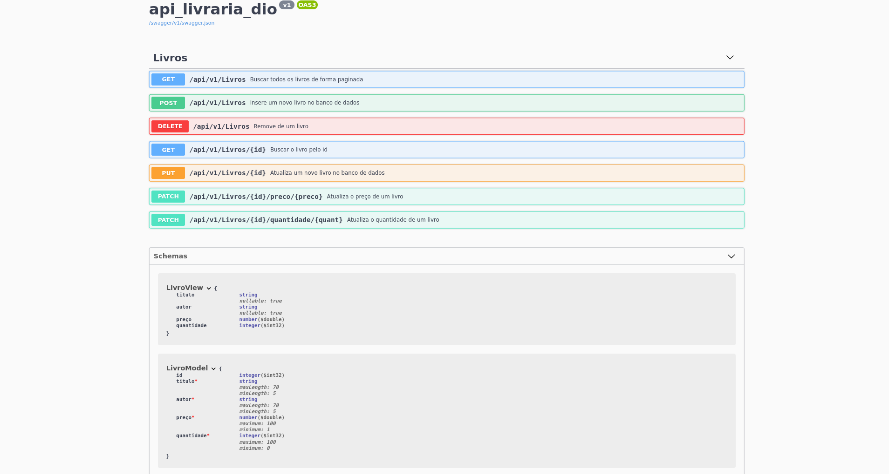

# Livraria DIO - API
Trabalho de conclusão do curso **Criando um catálogo de jogos usando boas práticas de arquitetura com .Net** do professor
**Thiago Campos de Oliveira**

## Alterações

A estrutura do projeto é a mesma, porem o tema de uma livraria, onde o objeto é livro. usei o ***Entity Framework*** com ***SQL SERVER***  para fazer o banco de dados

